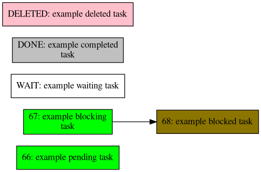

# task-graphdeps
Create a visual chart using [Taskwarrior](https://taskwarrior.org/) and [Graphviz](https://graphviz.org/) utilizing color to indicate task status and arrows to indicate dependency.

## Usage
```python
python graphdeps.py TASKFILTER
```
where `TASKFILTER` is the same as the arguments you would send to `task` to filter your tasks.

Example:
```python
python graphdeps.py project:fooproject status:pending
```


